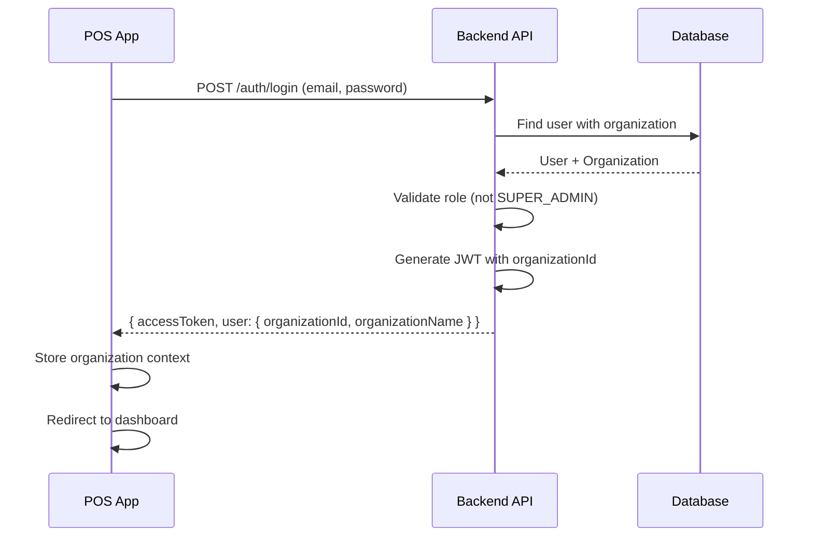
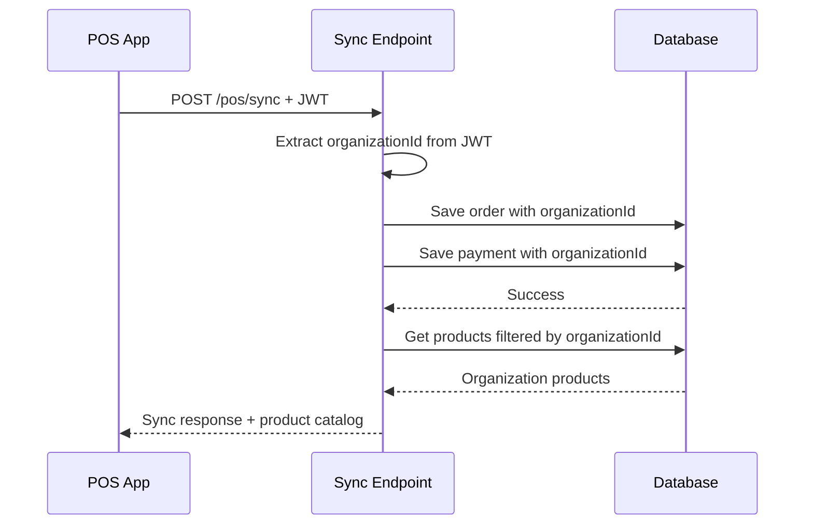

# POS App Multi-Tenant Integration - Update Summary

**Date Completed**: February 12, 2026  
**Status**: ✅ Complete

---

## Overview

The POS app has been successfully updated to integrate with the multi-tenant backend infrastructure. All tenant isolation, authentication, and organization context features are now fully functional.

---

## Changes Implemented

### 1. Shared Types Updates

**File**: `packages/shared-types/src/dtos.ts`

- ✅ Updated `AuthResponseDto` to include:
  - `organizationId: string | null`
  - `organizationName?: string`

This ensures the frontend receives complete organization context during login.

---

### 2. Backend Authentication Updates

**Files Modified**:

- `apps/backend-api/src/auth/auth.service.ts`
- `apps/backend-api/src/auth/auth.module.ts`
- `apps/backend-api/src/auth/strategies/jwt.strategy.ts`

**Changes**:

- ✅ Auth service now fetches user with organization relationship
- ✅ Login response includes `organizationId` and `organizationName`
- ✅ Last login timestamp tracked (`lastLoginAt`)
- ✅ JWT payload includes `organizationId` for all requests
- ✅ JWT strategy returns full user context including organization

---

### 3. Backend Sync Service Updates

**File**: `apps/backend-api/src/sync/sync.service.ts`

**Changes**:

- ✅ Orders created during sync include `organizationId` from user context
- ✅ Payments created during sync include `organizationId` from user context
- ✅ Product catalog filtered by organization (tenant-scoped)
- ✅ All sync operations respect multi-tenant boundaries

**Impact**: Offline POS transactions are now properly tenant-isolated when synced to the server.

---

### 4. POS Login Updates

**File**: `apps/pos/src/components/login-form.tsx`

**Changes**:

- ✅ Block SUPER_ADMIN role from accessing POS
  - Shows error: "Super Admins cannot access the POS system. Please use the Admin Portal."
- ✅ Validate organization association
  - Shows error if user has no `organizationId`
- ✅ Store organization context in localStorage:
  - `user` object with full details
  - `organizationId` for quick access
  - `organizationName` for display

**User Experience**: Clear error messages guide users to the correct system based on their role.

---

### 5. Auth Guard Updates

**File**: `apps/pos/src/components/auth-guard.tsx`

**Changes**:

- ✅ Import `UserRole` enum for type-safe role checking
- ✅ Additional validation on every route change:
  - Block SUPER_ADMIN from accessing POS routes
  - Validate user has `organizationId`
  - Clear invalid sessions and redirect to login
- ✅ Enhanced error handling with console logging

**Security**: Prevents unauthorized access even if localStorage is manually modified.

---

### 6. Navigation UI Updates

**File**: `apps/pos/src/components/navigation.tsx`

**Changes**:

- ✅ Display organization name below "AR-POS" logo
- ✅ Show user's full name (or email) in header
- ✅ Display user's role (ADMIN, MANAGER, CASHIER)
- ✅ Clean organization data on logout:
  - Remove `organizationId`
  - Remove `organizationName`
  - Remove `user` object

**UI Preview**:

```
🏪 AR-POS               [Products] [Orders]     👤 John Doe
   Demo Store                                      MANAGER
```

---

## Test Scenarios

### Scenario 1: Super Admin Attempts POS Login

```
Email: superadmin@pos.com
Password: super123

Expected Result:
❌ "Super Admins cannot access the POS system. Please use the Admin Portal."
```

### Scenario 2: Valid ADMIN Login

```
Email: admin@demo-store.com
Password: admin123

Expected Result:
✅ Login successful
✅ Organization: "Demo Store" displayed
✅ Role: "ADMIN" displayed
✅ Full access to POS, Products, Orders
```

### Scenario 3: Valid MANAGER Login

```
Email: manager@demo-store.com
Password: manager123

Expected Result:
✅ Login successful
✅ Organization: "Demo Store" displayed
✅ Role: "MANAGER" displayed
✅ Can manage inventory and process sales
```

### Scenario 4: Valid CASHIER Login

```
Email: cashier@demo-store.com
Password: cashier123

Expected Result:
✅ Login successful
✅ Organization: "Demo Store" displayed
✅ Role: "CASHIER" displayed
✅ Can process sales only
```

### Scenario 5: Offline Order Sync

```
1. Create order offline (POS app)
2. Go online and trigger sync
3. Order synced to backend with organizationId from JWT
4. Verify order only visible to users in same organization
```

---

## API Integration

### Authentication Flow



### Sync Flow



---

## Security Enhancements

### Role-Based Access Control

| Role        | POS Access | Inventory Access | Admin Portal |
| ----------- | ---------- | ---------------- | ------------ |
| SUPER_ADMIN | ❌ Blocked | ❌ Blocked       | ✅ Full      |
| ADMIN       | ✅ Full    | ✅ Full          | ❌ None      |
| MANAGER     | ✅ Full    | ✅ Full          | ❌ None      |
| CASHIER     | ✅ Limited | ❌ None          | ❌ None      |

### Data Isolation

- ✅ All orders include `organizationId`
- ✅ All payments include `organizationId`
- ✅ Product catalog filtered by organization
- ✅ Users cannot see other organizations' data
- ✅ Offline sync maintains tenant boundaries

---

## Next Steps

### Phase 4: Build Inventory System (Priority 1)

**Target**: `inventory.pos.com`

**Features to Build**:

- [ ] Product Management UI
  - CRUD operations for products
  - Bulk import/export
  - Stock adjustments
  - Low stock alerts
- [ ] User Management (ADMIN only)
  - Create MANAGER and CASHIER accounts
  - Assign terminals
  - User permissions
- [ ] Organization Settings
  - Business information
  - Tax rates
  - Receipt customization
- [ ] Reports & Analytics
  - Sales reports
  - Inventory reports
  - User activity logs

### Phase 5: Build Admin Portal (Priority 2)

**Target**: `admin.pos.com`

**Features to Build**:

- [ ] Organization Management (SUPER_ADMIN)
  - Create/edit/delete organizations
  - View all tenants
- [ ] Subscription Management
  - Plan upgrades/downgrades
  - Usage tracking
  - Billing history
- [ ] Platform Analytics
  - Total organizations
  - Revenue metrics
  - System health
- [ ] Stripe Integration
  - Webhook handling
  - Payment processing
  - Subscription lifecycle

---

## Running the Updated System

### Start Backend

```bash
cd apps/backend-api
npm run start:dev
```

Backend runs on: `http://localhost:3000`

### Start POS App

```bash
cd apps/pos
npm run dev
```

POS app runs on: `http://localhost:3001` (or next available port)

### Test with Sample Accounts

```
Organization: Demo Store (PROFESSIONAL Plan)
- admin@demo-store.com / admin123 (ADMIN)
- manager@demo-store.com / manager123 (MANAGER)
- cashier@demo-store.com / cashier123 (CASHIER)

Organization: Coffee Shop (BASIC Plan - Trial)
- admin@coffee-shop.com / admin123 (ADMIN)
- cashier@coffee-shop.com / cashier123 (CASHIER)

Platform Admin:
- superadmin@pos.com / super123 (SUPER_ADMIN - blocked from POS)
```

---

## Technical Notes

### LocalStorage Keys

The POS app now stores:

- `accessToken` - JWT for API authentication
- `user` - Full user object with role and organization
- `organizationId` - Quick reference for organization ID
- `organizationName` - Display name for UI
- `terminalId` - Terminal identifier (if assigned)

### JWT Payload Structure

```typescript
{
  sub: "user-uuid",           // User ID
  email: "user@example.com",
  role: "ADMIN",              // UserRole enum
  organizationId: "org-uuid", // Organization ID (null for SUPER_ADMIN)
  terminalId: "TERM-001",     // Terminal ID (optional)
  iat: 1234567890,            // Issued at
  exp: 1234567890             // Expires at
}
```

### Database Schema

All transaction tables now have `organizationId`:

- `orders` table - indexed on `organizationId`
- `payments` table - indexed on `organizationId`
- `products` table - indexed on `organizationId`
- `terminals` table - indexed on `organizationId`
- `users` table - references `organizations` table

---

## Troubleshooting

### Issue: SUPER_ADMIN can't access POS

**Expected Behavior**: This is correct! Super Admins should use the Admin Portal, not the POS system.

### Issue: User has no organization error

**Solution**: Check database - user must have `organizationId` set (except SUPER_ADMIN). Run seed script to create test users.

### Issue: Products not showing in POS

**Check**:

1. Products must belong to user's organization
2. Products must have `status = 'ACTIVE'`
3. Sync might be needed to pull latest catalog

### Issue: Orders syncing to wrong organization

**Check**: JWT token includes correct `organizationId`. Backend automatically sets organizationId from JWT, not from request body.

---

**Implementation**: Complete ✅  
**Testing**: Ready for manual QA  
**Deployment**: Ready for staging environment
